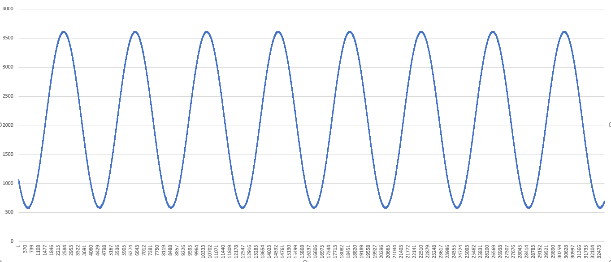

# STM32-Hotspot/SD Card ADC Data Logging application on the STWINKT1B

## Example

This Hotspot FW package includes:
* Application for Logging real-time continuous ADC data to an SD card on the STWINKT1B     
   * TIM triggered ADC with DMA for handling continuous ADC sampling at a customizable frequency
   * FATFS file system used to store ADC data on SD card in universal CSV format.
   * Ring buffer management of real-time data to increase throughput without losing data.
   * Optimized itoa() function for increased throughput.
   * Example created in STM32CubeMX from IOC file.      
   * Development tools, toolchains/compilers: STM32CubeMX 6.5.0, STM32CubeIDE 1.9.0
   * Supported Devices and hardware boards: STEVAL-STWINKT1B
   * Known limitations: None

## Board Needed

  * [STEVAL-STWINKT1B](https://www.st.com/en/evaluation-tools/steval-stwinkt1b.html)

## Users Guide

#### Making the Program Work
  * Open the project in STM32CubeIDE
  * Rebuild all files and load your image into target memory

* Make sure the SD card is in the STWINKT1B on reset.

* The ADC signal to be read is input onto EX_ADC Pin 13 on the STMOD connector. Note the analog voltage on the board is 2.7V, so this is the maximum voltage that the ADC will be able to read. In the image below, black wire goes to GND, blue wire goes to EX_ADC.

 

  

#### Data Logging Process

* By default, the ADC samples as 40kHz. This can be changed easily through the #define in main.c
* #define SAMP_FREQ 			    40000

* The data logging is controlled via the white USER button on the board next to the RESET button. Feedback about the status of the write is given through LEDs.

* To start logging data, press the USER button. The GREEN LED will come on to indicate that the writing to the SD card has started

* To stop the writing, press the USER button again. The GREEN LED will turn off once all of the data is done being written to the SD card. At this point, there is a file on the SD card called ADCVALS1.CSV. The CSV files are comprised of one column of data, which is raw 12-bit ADC values.

* The program is now waiting idle for another USER button press. Pressing the user button a second time will create a second CSV file to write to. After ending the logging with another USER button press, there will no be a second CSV file on the SD card called ADCVALS2.CSV

* The orange LED is used to indicate error status. Solid orange indicates an error that requires reset (memory allocation issue, initializations errors). When the orange LED blinks then turns off, this indicates that the internal ring buffer has overflown. Writing will automatically stop and remaining data written to the SD card. The board is then ready to log again. (More on ring buffer in Application Details)

* With the data logged in the universal CSV format, you can graph the ADC data in your application of choice. For example, here is a 10Hz sine wave, ranging from .35V to 2.35V, graphed in excel

  

  

#### Application Details

The application is made with a few #define statements that allow the end user to modify application parameters:

#define SAMP_FREQ 			    40000
#define DMA_BUFF_LENGTH		  8192
#define RING_BUFFER_CHUNKS  8

* SAMP_FREQ is the ADC sampling frequency in HZ.
* DMA_BUFF_LENGTH is the length of the ADC DMA buffer, which is comprised of uint16_t
* RING_BUFFER_CHUNKS is the length of the intermediary ring buffer in terms of DMA_BUFF_LENGTH. In other words, total ring buffer length is DMA_BUFF_LENGTH * RING_BUFFER_CHUNKS.

These parameters can be adjusted, and all of these have an affect on how much data can be sampled before the Ring Buffer is overflown. At lower sampling frequencies, it is possible to directly move data from the ADC DMA buffer to the SD card by using the DMA buffer in a ping pong fashion via the half transfer complete and transfer complete ADC callbacks. As the sampling frequency is increased though, it becomes impossible to write the half ADC DMA buffers chunks to the SD card in time before the other half of the DMA buffer is filled. To allow for a higher sampling rate, a intermediary ring buffer is used. The ADC DMA buffers feed the ring buffer, and the logging consumes the ring buffer. Because the ring buffer is allocated at a set size, eventually it will always overflow.

The above define statements allow you to create a tradeoff between data throughput and RAM usage. If SAMP_FREQ is increased and the ring buffer is overflowing too quickly, then you can increase DMA_BUFF_LENGTH and RING_BUFFER_CHUNKS to allow more data to be logged before the ring buffer is overflown. More data at high sampling rates can be achieved, but at the cost of increased RAM usage.

**Caution**: When an overflow occurs on the ring buffer, some of the samples near the end of the logged data will be out of sync. For perfectly continuous data all the way to end of the data log, the acquisition needs to be stopped before overflow occurs.

## Troubleshooting

**Known Limitation** :For the application to work properly, the SD card needs to be inserted into the STWINKT1B on reset, else the SD card and FATFS drivers will not initialize properly. If the application was already running when you insert the SD card, you will need to press the black RESET button on the board.

**Caution** : Issues and the pull-requests are **not supported** to submit problems or suggestions related to the software delivered in this repository. The ADCDataLog example is being delivered as-is, and not necessarily supported by ST.

**For any other question** related to the product, the hardware performance or characteristics, the tools, the environment, you can submit it to the **ST Community** on the STM32 MCUs related [page](https://community.st.com/s/topic/0TO0X000000BSqSWAW/stm32-mcus).
